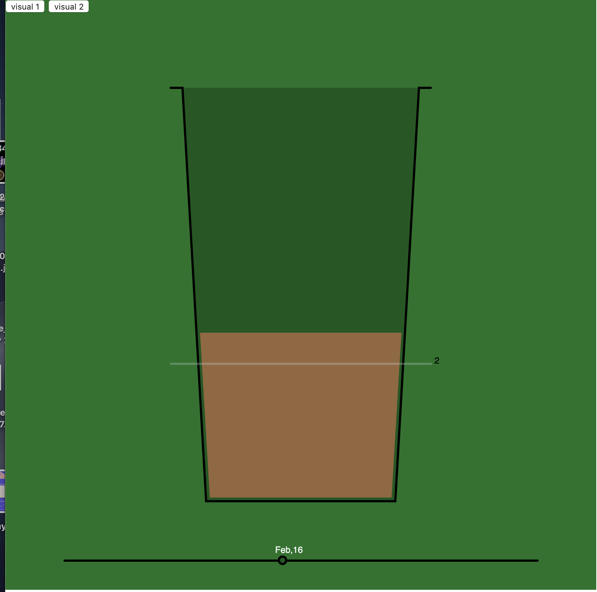
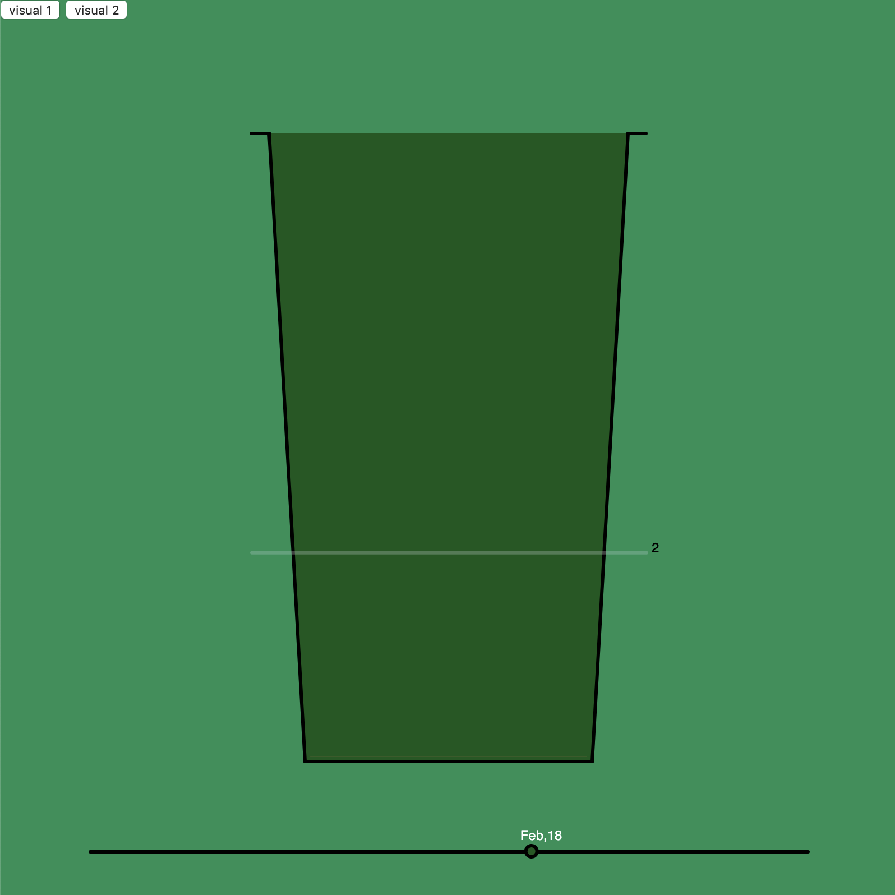
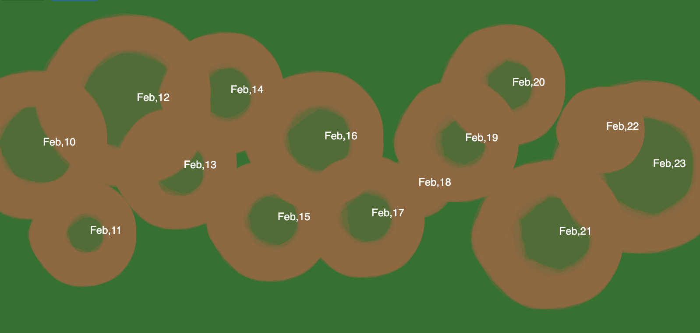

This is project from Data Art class ITP2019  https://github.com/veev/DataArtFall2019
I tracked amount of coffee i drink daily for two weeks, and visualized them filling in a cup. i mapped it with maximum of 6 cups, and it animate through each day frame by frame.

  

and i made a second visualization to see all data of two weeks at once. The data are showed by the size of coffee stains.

